# AI-Powered Labour Market Intelligence & Skill Demand-Supply Forecasting Engine

> A government-facing intelligence platform for analysing labour-market demand, estimating workforce supply, forecasting future skill shortages, and generating evidence-based skilling recommendations.

## System Workflow

```mermaid
flowchart TD
    %% ==========================================
    %% 1. RAW DATA SOURCES & INGESTION
    %% ==========================================
    subgraph S1["1. Multi-Source Ingestion & Taxonomies"]
        direction TB
        RawJobs["Raw Job Postings & Portals<br/>(NCS, Naukri, LinkedIn)"]
        GovtData["Official Labour Surveys<br/>(PLFS, AISHE, PMKVY, DVET, UDISE)"]
        Taxonomies["National & Global Taxonomies<br/>(NCO-2015, ESCO, NQR, O*NET)"]
    end

    %% ==========================================
    %% 2. NLP & SEMANTIC TAXONOMY ALIGNMENT
    %% ==========================================
    subgraph S2["2. NLP & Skill Extraction Layer"]
        direction TB
        M2["[Model 2] Transformer NER / Skill Extractor<br/>Extracts skills, certifications & qualifications"]
        M1["[Model 1] Sentence-BERT / all-MiniLM<br/>Semantic dense embeddings & skill-to-NCO mapping"]
        VectorDB[("FAISS / Vector Index<br/>(Skill & Taxonomy Embeddings)")]

        RawJobs --> M2
        M2 --> M1
        Taxonomies --> M1
        M1 --> VectorDB
    end

    %% ==========================================
    %% 3. REPOSITORY & CANONICAL FEATURE STORE
    %% ==========================================
    subgraph S3["3. Unified Master Data Warehouse"]
        direction TB
        MasterStore[("Canonical Master Data Store<br/>(Demand, Supply, Vacancies, Wages, Geographies)")]

        GovtData --> MasterStore
        M1 --> MasterStore
    end

    %% ==========================================
    %% 4. TIME-SERIES & REGRESSION FORECASTING
    %% ==========================================
    subgraph S4["4. Demand-Supply Forecasting Engine"]
        direction TB
        M3["[Model 3] ARIMA<br/>Statistical baseline trend forecaster"]
        M4["[Model 4] Exponential Smoothing (ETS)<br/>Trend & seasonality benchmark"]
        M5["[Model 5] XGBoost Regressor<br/>Primary multi-variate forecaster (3/6/12 months)"]
        M6["[Model 6] LightGBM<br/>High-speed comparative benchmark & ensemble"]
        EnsembleForecast{"Forecast Arbiter / Ensemble<br/>(Validation Metric Best-Fit)"}

        MasterStore --> M3
        MasterStore --> M4
        MasterStore --> M5
        MasterStore --> M6

        M3 --> EnsembleForecast
        M4 --> EnsembleForecast
        M5 --> EnsembleForecast
        M6 --> EnsembleForecast
    end

    %% ==========================================
    %% 5. SHORTAGE CLASSIFICATION & CALIBRATION
    %% ==========================================
    subgraph S5["5. Shortage Risk Classification & Calibration"]
        direction TB
        GapCalc["Demand-Supply Gap Calculator<br/>(Net Shortage Ratio & Pressure Scores)"]
        M7["[Model 7] XGBoost Classifier<br/>Shortage Severity: Low, Med, High, Critical"]

        M8["[Model 8] Isotonic Regression<br/>Non-parametric probability calibration"]
        M9["[Model 9] Platt Scaling<br/>Logistic sigmoid probability calibration"]
        CalibratedRisk{"Calibrated Risk Confidence<br/>(Brier Score Optimizer)"}

        MasterStore --> GapCalc
        EnsembleForecast --> GapCalc
        GapCalc --> M7
        M7 --> M8
        M7 --> M9
        M8 --> CalibratedRisk
        M9 --> CalibratedRisk
    end

    %% ==========================================
    %% 6. EXPLAINABLE AI
    %% ==========================================
    subgraph S6["6. Explainability Layer"]
        direction TB
        M10["[Model 10] SHAP TreeExplainer<br/>Computes feature attributions & risk drivers"]
        CalibratedRisk --> M10
        M7 -.-> M10
    end

    %% ==========================================
    %% 7. POLICY GENERATION & CONVERSATIONAL AI
    %% ==========================================
    subgraph S7["7. Policy Engine & Generative Copilot"]
        direction TB
        RulesEngine["Policy Rules Engine<br/>(Curriculum, ITI Seat Allocation, Subsidies)"]
        RAG["Context Grounding & Prompt Builder<br/>(DB Facts + SHAP Attribution + Retrieved Interventions)"]
        M11["[Model 11] Qwen2.5 1.5B Instruct (Ollama)<br/>RAG-grounded Policy Intelligence Copilot"]

        CalibratedRisk --> RulesEngine
        M10 --> RAG
        RulesEngine --> RAG
        VectorDB -.-> RAG
        RAG --> M11
    end

    %% ==========================================
    %% 8. SERVING & INTERFACE
    %% ==========================================
    subgraph S8["8. Presentation & Delivery"]
        direction TB
        APIServer["FastAPI Enterprise Gateway<br/>(REST API + Streaming LLM Endpoints)"]
        GovUI["National Labour Market Intelligence Portal<br/>(Interactive Heatmaps, Gap Forecasts, Policy Reports)"]
        Policymaker(("Policymaker / Government Official"))

        EnsembleForecast --> APIServer
        CalibratedRisk --> APIServer
        M10 --> APIServer
        M11 --> APIServer

        APIServer --> GovUI
        GovUI --> Policymaker
    end

    %% ==========================================
    %% VISUAL STYLING
    %% ==========================================

    classDef source fill:#e8f1ff,stroke:#2563eb,stroke-width:2px,color:#111827;
    classDef nlp fill:#fff1e6,stroke:#ea580c,stroke-width:2px,color:#111827;
    classDef store fill:#eef2ff,stroke:#4f46e5,stroke-width:2px,color:#111827;
    classDef forecast fill:#f3e8ff,stroke:#7c3aed,stroke-width:2px,color:#111827;
    classDef risk fill:#fff7ed,stroke:#ea580c,stroke-width:2px,color:#111827;
    classDef xai fill:#ecfdf5,stroke:#059669,stroke-width:2px,color:#111827;
    classDef policy fill:#ecfeff,stroke:#0891b2,stroke-width:2px,color:#111827;
    classDef api fill:#f0fdf4,stroke:#16a34a,stroke-width:2px,color:#111827;
    classDef decision fill:#fefce8,stroke:#ca8a04,stroke-width:2px,color:#111827;
    classDef user fill:#111827,stroke:#111827,stroke-width:2px,color:#ffffff;

    class RawJobs,GovtData,Taxonomies source;
    class M1,M2 nlp;
    class VectorDB,MasterStore store;
    class M3,M4,M5,M6 forecast;
    class GapCalc,M7,M8,M9 risk;
    class M10 xai;
    class RulesEngine,RAG,M11 policy;
    class APIServer,GovUI api;
    class EnsembleForecast,CalibratedRisk decision;
    class Policymaker user;
```



## Overview

The system is designed to answer:

* What jobs and skills are currently in demand?
* How strong is demand for each occupation and skill?
* How much labour supply is estimated to be available?
* Which skills have shortages or oversupply?
* Which skills are likely to become more important over the next 3, 6, and 12 months?
* Which state, district, sector, occupation, or skill has the highest shortage?
* What training and skilling interventions should be prioritized?
* Why does the system predict a particular shortage?
* Can policymakers query the system using natural language?

This is **not** a traditional job portal.

This is **not** a resume screening system.

This is **not** a candidate matching system.

## Core Architecture

```text
Labour Market Data
        ↓
Data Ingestion
        ↓
Data Cleaning & Quality Assurance
        ↓
Job & Skill Intelligence
        ↓
Demand Intelligence
        ↓
Supply Estimation
        ↓
Demand-Supply Gap
        ↓
Forecasting
        ↓
Shortage Risk
        ↓
SHAP Explainability
        ↓
Policy Recommendation
        ↓
AI Policy Copilot
        ↓
Government Dashboard
```

## Final 11-Component Intelligence Stack

| #  | Model / Method                    | Purpose                                           |
| -- | --------------------------------- | ------------------------------------------------- |
| 1  | Sentence-BERT / all-MiniLM        | Semantic embeddings and skill/occupation matching |
| 2  | Transformer NER / Skill Extractor | Skill and entity extraction                       |
| 3  | ARIMA                             | Statistical forecasting baseline                  |
| 4  | Exponential Smoothing             | Trend/seasonality baseline                        |
| 5  | XGBoost Regressor                 | Primary multivariate forecasting                  |
| 6  | LightGBM                          | Comparative forecasting benchmark                 |
| 7  | XGBoost Classifier                | Shortage-risk classification                      |
| 8  | Isotonic Regression               | Probability calibration                           |
| 9  | Platt Scaling                     | Probability calibration alternative               |
| 10 | SHAP TreeExplainer                | Model explainability                              |
| 11 | Qwen2.5 1.5B Instruct             | Local AI Policy Copilot                           |

### Supporting technologies

* Cosine Similarity
* Skill Dictionary
* NCO-2015 Mapping
* Skill Taxonomy
* Weighted Demand Score
* FAISS
* RAG
* Rule-Based Policy Engine
* Optimization / Constraints
* SQLite
* FastAPI
* HTML
* CSS
* Vanilla JavaScript

## Demand Score Engine

The current-demand score is an interpretable weighted index rather than a black-box ML model.

| Signal             | Weight |
| ------------------ | -----: |
| Job Posting Volume |    30% |
| Vacancy Volume     |    25% |
| Skill Frequency    |    20% |
| Demand Growth      |    15% |
| Employer Breadth   |    10% |

```text
Demand Score =
0.30 × Job Posting Volume
+ 0.25 × Vacancy Volume
+ 0.20 × Skill Frequency
+ 0.15 × Demand Growth
+ 0.10 × Employer Breadth
```

All components are normalized before aggregation.

If vacancy data is unavailable:

* Do not fabricate vacancy counts.
* Do not assume one posting equals one vacancy.
* Make vacancy weighting configurable.
* Clearly show unavailable signals.

## Labour-Market Hierarchy

```text
India
  ↓
State
  ↓
District
  ↓
Sector
  ↓
Occupation
  ↓
Skill
```

Each analytical level can expose:

* Demand
* Supply
* Gap
* Shortage Ratio
* Demand Score
* Demand Trend
* Supply Trend
* 3-Month Forecast
* 6-Month Forecast
* 12-Month Forecast
* Shortage Risk
* Confidence
* Training Capacity
* Policy Recommendation

## Data Sources

### Demand Data

Preferred fields:

```text
job_id
job_title
job_description
skills
occupation
sector
company
state
district
city
posting_date
vacancy_count
salary
experience
source
```

### Supply Data

Preferred fields:

```text
state
district
occupation
industry
education
employment_status
labour_force
workers
unemployment
technical_education
```

### Training Data

Preferred fields:

```text
state
district
course
skill
occupation
training_provider
training_capacity
enrolled
completed
certified
date
```

### Taxonomy Data

```text
raw occupation
      ↓
standardized occupation
      ↓
NCO code
```

```text
raw skill
      ↓
canonical skill
      ↓
skill category
```

### Economic / Sector Data

Potential features:

```text
sector
state
date
employment
industry growth
output
investment
economic indicators
```

## Current Naukri Dataset Usage

Naukri-derived datasets may contain:

* Job Title
* Company
* Experience
* Package / Salary
* Location
* Skills
* Posting information
* URL

These datasets primarily support **Demand Intelligence**.

They must **not** be treated as direct labour-supply datasets.

They must **not** automatically be interpreted as a complete representation of the Indian labour market.

Preserve:

* `source_dataset`
* `source_record_id`
* `ingestion_date`

for data provenance.

## Core Data Pipeline

```text
Raw Data
   ↓
Schema Detection
   ↓
Cleaning
   ↓
Duplicate Detection
   ↓
Location Normalization
   ↓
Skill Extraction
   ↓
Skill Normalization
   ↓
Occupation Mapping
   ↓
NCO-2015 Mapping
   ↓
Demand Aggregation
   ↓
Master Labour-Market Data
```

## Skill Normalization

Examples:

```text
ML
Machine Learning
Machine-Learning
        ↓
Machine Learning
```

```text
ReactJS
React.js
React JS
        ↓
React
```

Each mapping should store:

* raw skill
* canonical skill
* similarity score
* mapping method
* confidence
* taxonomy ID

## Occupation Normalization

Examples:

```text
Data Scientist
Data Science Specialist
Machine Learning Specialist
ML Engineer
AI Engineer
```

must **not** automatically be treated as one identical occupation.

Use taxonomy-based classification and preserve meaningful distinctions.

Use NCO-2015 wherever applicable.

## Demand-Supply Gap

```text
Gap = Demand - Estimated Supply
```

```text
Shortage Ratio =
(Demand - Estimated Supply) / Demand
```

Possible categories:

* Balanced
* Moderate
* High
* Critical

Thresholds must be configurable.

Do not present arbitrary thresholds as universal economic definitions.

## Forecasting Architecture

```text
Historical Labour-Market Data
           ↓
    Feature Engineering
           ↓
     Chronological Split
           ↓
     ┌─────┼─────┬─────┐
     ↓     ↓     ↓     ↓
   ARIMA  ETS  XGBoost LightGBM
     └─────┼─────┴─────┘
           ↓
       Validation
           ↓
 Selected Model / Ensemble
           ↓
    3 / 6 / 12 Month Forecast
```

Evaluation metrics:

* MAE
* RMSE
* MAPE where appropriate

Do not use random train/test splitting for time-series forecasting.

## Shortage Risk Architecture

```text
Current Gap
     +
Demand Growth
     +
Supply Growth
     +
Vacancy Growth
     +
Training Capacity
     +
Sector Growth
     +
Historical Trends
     ↓
XGBoost Classifier
     ↓
Raw Risk Probability
     ↓
Isotonic Regression / Platt Scaling
     ↓
LOW / MEDIUM / HIGH / CRITICAL
     ↓
SHAP
     ↓
Explanation
```

## Explainability

Every major ML result should include:

* Prediction
* Probability
* Top Features
* Feature Contributions
* Human-Readable Explanation

Example:

```text
Shortage Risk = HIGH

Top contributing factors:
1. Demand Growth
2. Vacancy Growth
3. Historical Gap
4. Low Training Capacity
5. Supply Growth
```

## Policy Recommendation Engine

Inputs:

* Current Demand
* Estimated Supply
* Current Gap
* Forecast Demand
* Forecast Supply
* Forecast Gap
* Shortage Risk
* Training Capacity
* Training Completion
* Sector Growth
* Location

The engine answers:

**WHERE + WHICH SKILL + HOW MUCH + WHEN**

Example:

```text
Location:
Pune, Maharashtra

Occupation:
Data Analyst

Skills:
Python
SQL
Power BI

Current:
High demand
Supply below demand

Forecast:
Projected shortage in 6 months

Training:
Capacity insufficient

Recommendation:
Evaluate expansion of relevant training capacity.
```

The policy engine uses verified analytical outputs and deterministic rules.

## AI Policy Copilot

Example query:

> Which skills will have the highest shortage in Maharashtra IT sector in the next 6 months?

Architecture:

```text
Policymaker Question
        ↓
Query Understanding
        ↓
Structured Database Query
        ↓
Verified Results
        ↓
RAG Context
        ↓
Qwen2.5 1.5B
        ↓
Natural-Language Explanation
```

The LLM:

* does not calculate demand
* does not calculate supply
* does not generate forecasts
* does not generate shortage probabilities
* does not invent statistics

It only explains verified outputs from the ML/statistical pipeline.

## Government Dashboard

### National Overview

* Total Demand
* Estimated Supply
* Total Gaps
* High-Risk Occupations
* High-Risk Skills
* Emerging Skills
* Training Capacity Indicators

### Regional Intelligence

```text
India
  ↓
State
  ↓
District
  ↓
Sector
```

Shows:

* Demand
* Supply
* Shortage Heatmap
* Sector Trends
* High-Risk Occupations
* Forecasts
* Recommendations

### Occupation Intelligence

* Occupation Demand
* Occupation Supply
* Occupation Gap
* Associated Skills
* Forecast
* Risk
* SHAP Explanation

### Skill Intelligence

* Demand Score
* Skill Frequency
* Demand Growth
* Estimated Supply
* Shortage Ratio
* Forecast
* Risk Category
* Training Capacity

### Forecast Explorer

* Historical Trend
* 3-Month Forecast
* 6-Month Forecast
* 12-Month Forecast
* Confidence / Uncertainty

### Policy Recommendations

* Location
* Occupation
* Skill
* Shortage Level
* Projected Gap
* Training Capacity
* Recommendation

### AI Policy Copilot

Natural-language policy query interface over verified labour-market results.

## Local Architecture

```text
Browser
   ↓
Government Dashboard
   ↓
FastAPI
   ↓
SQLite / Analytics Engine
   ├── Demand Engine
   ├── Supply Estimator
   ├── Gap Engine
   ├── Forecasting
   ├── Shortage Risk
   ├── SHAP
   ├── Policy Engine
   └── RAG / Copilot
          ↓
       Ollama
          ↓
   Qwen2.5 1.5B
```

## Local AI Stack

```text
Ollama
├── qwen2.5:1.5b
└── all-minilm
```

Environment:

```text
OLLAMA_BASE_URL=http://localhost:11434
LLM_MODEL=qwen2.5:1.5b
EMBEDDING_MODEL=all-minilm
```

The core analytical engine must continue to work if Ollama is unavailable.

## 8 GB RAM Strategy

The prototype is designed for:

* 8 GB RAM
* CPU-first execution
* No dedicated GPU requirement
* Lazy model loading
* Small embedding batches
* LLM concurrency of 1
* XGBoost `n_jobs=2`
* No large local LLM
* No local fine-tuning
* No LSTM/GRU in the initial prototype

## API Layer

FastAPI exposes the analytical engine through REST endpoints.

Core endpoints include:

```text
GET  /health
GET  /api/datasets
GET  /api/locations
GET  /api/occupations
GET  /api/skills
GET  /api/demand
GET  /api/supply
GET  /api/gaps
GET  /api/forecasts
GET  /api/shortage-risk
GET  /api/explanations/{id}
GET  /api/policy/recommendations
POST /api/policy/query
```

API documentation:

`http://localhost:8000/docs`

## Data Integrity Principles

1. No fabricated labour-market numbers.
2. LLM is never the numerical source of truth.
3. Demand Score is interpretable.
4. Forecasting uses time-aware validation.
5. Supply estimates report uncertainty.
6. Predictions maintain data provenance.
7. Core analytics work without the LLM.
8. Local models remain lightweight.
9. No resume-screening functionality is part of the core engine.
10. The platform is designed for government labour-market intelligence rather than job search.

## Known Limitations

The prototype must communicate dataset limitations accurately.

Examples:

* Vacancy counts may not be available at posting level.
* Some datasets are snapshots rather than true historical time series.
* Skill-level labour supply may require estimation.
* Geographic demand may be more reliable at state/city level than district level.
* Long-horizon forecasts may have lower confidence when historical observations are limited.
* Training flows are not necessarily equivalent to available skilled-worker stock.
* The system is a data-informed intelligence platform, not an oracle of future labour-market conditions.

## Project Structure

```text
labour-market-intelligence/
├── data/
│   ├── raw/
│   ├── interim/
│   ├── processed/
│   ├── master/
│   └── exports/
├── backend/
├── ml/
│   ├── embeddings/
│   ├── skill_extraction/
│   ├── taxonomy/
│   ├── demand/
│   ├── supply/
│   ├── forecasting/
│   ├── shortage/
│   └── explainability/
├── pipeline/
├── taxonomy/
├── frontend/
├── configs/
├── models/
├── tests/
├── docs/
└── README.md
```

## Development Roadmap

```text
1. Data Ingestion
        ↓
2. Cleaning & Normalization
        ↓
3. Skill Intelligence
        ↓
4. Demand Score
        ↓
5. Supply Estimation
        ↓
6. Demand-Supply Gap
        ↓
7. Forecasting
        ↓
8. Shortage Risk
        ↓
9. Calibration & SHAP
        ↓
10. Policy Engine
        ↓
11. AI Policy Copilot
        ↓
12. FastAPI
        ↓
13. Government Dashboard
        ↓
14. Integration Testing
        ↓
15. Demo Packaging
```

## Final Objective

The system transforms fragmented labour-market information into a transparent intelligence platform that helps policymakers identify:

**Where demand exists → where supply is insufficient → which skills are becoming important → where shortages are likely to emerge → what skilling interventions should be considered.**
