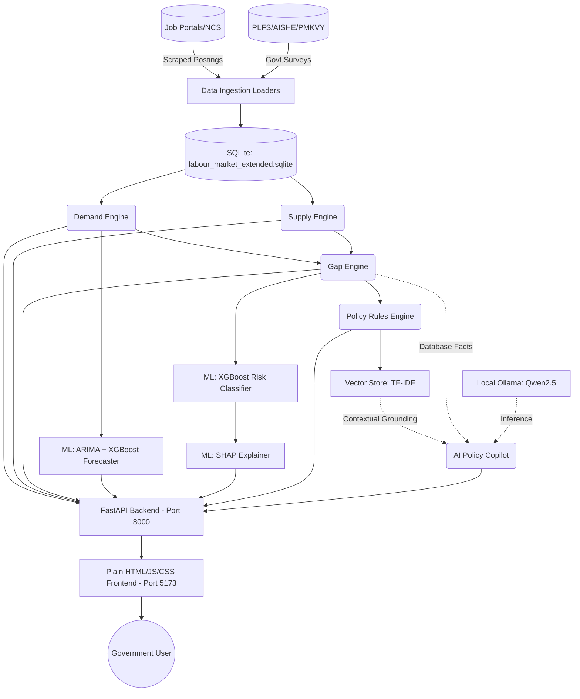

# AI-Powered Labour Market Intelligence Engine - Summary

## 1. What ML Models Are Being Used?

The prototype integrates several Machine Learning models for forecasting, classification, explainability, and Natural Language Processing (NLP):

### Predictive & Classification Models (Scikit-Learn, XGBoost, Statsmodels)
- **Time-Series Baseline Model**: `ARIMA(1, 1, 0)` is used to model historical demand trends and provide a statistical baseline forecast.
- **Machine Learning Forecaster**: `XGBRegressor` (XGBoost) or `GradientBoostingRegressor` (as a fallback) is used as part of a hybrid **ARIMA-XGBoost** model to predict 3-month, 6-month, and 12-month future Demand Scores.
- **Shortage Risk Classifier**: `XGBClassifier` (XGBoost) is used to categorize the gap between supply and demand into four classes: *Oversupply, Balanced, Moderate Shortage, Critical Shortage*.

### Explainable AI (XAI)
- **SHAP (SHapley Additive exPlanations)**: `shap.TreeExplainer` is used on top of the XGBoost classifier to provide interpretable feature contributions (e.g., explaining exactly *why* a specific occupation is facing a critical shortage).

### NLP & Retrieval-Augmented Generation (RAG)
- **Local LLM**: **Qwen2.5 (1.5B)** via Ollama is used by the AI Policy Copilot to generate natural language answers.
- **Vector Search / Embeddings**: A baseline `TfidfVectorizer` (with cosine similarity) serves as a lightweight local Vector Store to index and retrieve relevant policy interventions without requiring heavy neural embeddings, while Ollama supports `bge-m3` for dense embeddings if configured.

---

## 2. What is the Prototype Actually Doing?

The prototype acts as an **end-to-end local platform for policymakers** to understand and react to the labour market. It processes various data sources (like PLFS, AISHE, NCS, and Job Portals) and provides:

1. **Demand & Supply Scoring**: It standardizes disparate datasets to calculate a unified `Demand Score` (0-100) and an `Estimated Supply` volume for occupations, skills, and sectors.
2. **Gap & Shortage Detection**: It compares demand and supply to detect severe workforce bottlenecks.
3. **Forecasting**: It predicts future demand so governments can prepare training capacity ahead of time.
4. **Policy Generation**: It automatically recommends specific interventions (e.g., "Reallocate 30% of training subsidies") based on the predicted gaps.
5. **AI Copilot**: A chat interface that allows users to ask natural language questions and receive answers strictly grounded in the engine's real-time database facts.

---

## 3. Workflow Flowchart (Local Execution)

Below is the complete local workflow of how data flows from ingestion to the user interface:

